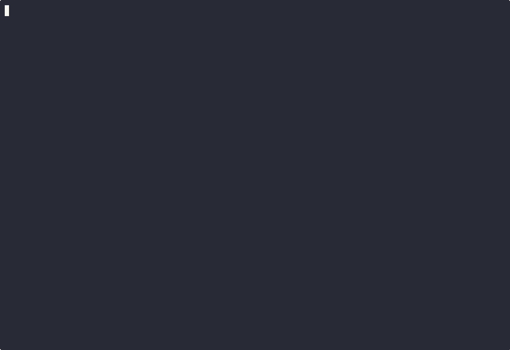

# dupehound — Examples & Use Cases



> Demo: dupehound run against [`axeforging/tacomex-8bit-shop`](https://github.com/axeforging/tacomex-8bit-shop) — a real React + Fastify sample app, 69 source files, ~14k LOC. Finds 163 clones and 19 dead-function candidates in seconds. Regenerate with `bash docs/demo/setup.sh && python3 path/to/cast.py docs/demo/cast.yaml`.

Practical, copy-pasteable recipes for the things dupehound is good at. Each section is collapsed by default — open the ones you need.

> Quick links: [Pre-commit](#pre-commit-hook) · [CI / PR comments](#ci-on-pull-requests) · [Diff-aware](#diff-aware-scanning) · [Filtering](#filtering-files) · [Suppression](#suppressing-known-duplicates) · [Test↔Prod](#testprod-leak-detection) · [Git churn](#git-churn-ranking) · [Dead code](#dead-function-detection) · [Safe-mode for big repos](#safe-mode-profiles-for-large-repos) · [Hook output for AI](#hook-output-and-ai-readability) · [Output formats](#output-formats) · [Real-world trial](#real-world-trial-clicli)

---

## Quick reference

| I want to… | Recipe |
|---|---|
| Run a fast local scan | [`dupehound scan --top 10`](#basic-scan) |
| Adopt dupehound on a repo with existing duplication | [baseline ratchet](#baseline-ratchet) |
| Block PRs that introduce new clones | [diff-aware CI](#diff-aware-scanning) or [baseline ratchet](#baseline-ratchet) |
| Get inline PR annotations without SARIF setup | [`--format github`](#github-actions-inline-annotations) |
| Catch duplicates only in changed files | [`--staged`](#pre-commit-hook) or [`--since`](#diff-aware-scanning) |
| Skip vendor / generated / build dirs | [`--exclude` with `**`](#filtering-files) |
| Scan only one subtree | [`--include`](#filtering-files) |
| Hide a known false positive forever | [`.dupehound-ignore`](#suppressing-known-duplicates) |
| Hide a one-off duplicate inline | [`//dupehound:ignore`](#suppressing-known-duplicates) |
| Find test-fixture leaks into production code | [`--test-prod`](#testprod-leak-detection) (auto-detected) |
| Prioritise refactor by churn | [`--git-churn`](#git-churn-ranking) |
| Find probably-unused functions | [`--dead-code`](#dead-function-detection) |
| Run safely on a 100k-file monorepo | [Safe-mode profiles](#safe-mode-profiles-for-large-repos) |
| Cap memory / fail fast on runaway scans | [`--max-files` / `--max-pairs`](#safe-mode-profiles-for-large-repos) |
| Silence hook log noise but keep failure reasons | [`--quiet` for hooks](#hook-output-and-ai-readability) |
| Post a PR comment | [`--format md`](#output-formats) |
| Feed GitHub Code Scanning | [`--format sarif`](#output-formats) |

---

## Basic scan

<details>
<summary><b>Run a scan and read the output</b></summary>

```sh
dupehound scan --top 10
```

The default output (text) starts with a summary table, then lists the top hotspot files (highest duplication %), then a `Test↔Prod clones` section if any cross-test/production leaks were found, then the top 10 clones by impact. Each clone entry shows similarity, line/token count, instance locations, and a code preview.

Tune `--min-tokens` to control sensitivity (lower = catches smaller blocks):

```sh
dupehound scan --min-tokens 30   # ~3 lines of average code
dupehound scan --min-tokens 80   # only larger blocks
```

The `--top` flag controls how many clones land in the listing (default 10). Use `--top 0` for the full set.
</details>

---

## Pre-commit hook

<details>
<summary><b>Lefthook (recommended)</b></summary>

`.lefthook.yml`:

```yaml
pre-commit:
  commands:
    dupehound:
      run: dupehound scan --staged --similarity 1.0 --min-tokens 80 --top 5
```

Why these flags:

- `--staged` reports only clones whose instances touch a file you're about to commit.
- `--similarity 1.0` disables fuzzy (type-3) detection, which is the slowest path. For pre-commit you want fast and decisive — type-1/2 only.
- `--min-tokens 80` raises the threshold so you don't flag tiny accidental matches on every commit.
- `--top 5` keeps the failure message terse.

This hook will exit non-zero if any new staged file participates in a clone, blocking the commit. Add `--exit-zero` if you want it advisory.
</details>

<details>
<summary><b>Plain git pre-commit hook</b></summary>

`.git/hooks/pre-commit`:

```sh
#!/bin/sh
exec dupehound scan --staged --similarity 1.0 --min-tokens 80 --top 5
```

Make it executable:

```sh
chmod +x .git/hooks/pre-commit
```
</details>

---

## CI on pull requests

<details>
<summary><b>GitHub Actions — comment a markdown report on the PR</b></summary>

```yaml
name: dupehound
on:
  pull_request:
jobs:
  scan:
    runs-on: ubuntu-latest
    steps:
      - uses: actions/checkout@v4
        with:
          fetch-depth: 0  # required for --since to resolve refs

      - name: Install dupehound
        run: |
          curl -fsSL https://raw.githubusercontent.com/AxeForging/dupehound/main/install.sh | sh

      - name: Scan diff
        run: |
          dupehound scan \
            --since origin/${{ github.base_ref }} \
            --format md \
            --output dupe.md \
            --top 10 \
            --exit-zero

      - name: Comment on PR
        uses: marocchino/sticky-pull-request-comment@v2
        with:
          path: dupe.md
          header: dupehound
```

The markdown report uses collapsible `<details>` blocks for each clone, includes 🧪 test↔prod and 🔥 churn badges where applicable, and stays well under GitHub's 65 KB comment limit on typical repos. `--exit-zero` keeps the job green so the comment is the signal — switch it off if you want PRs blocked.
</details>

<details>
<summary><b>GitHub Actions — block PRs that introduce new clones</b></summary>

```yaml
- name: Block new duplicates
  run: |
    dupehound scan \
      --since origin/${{ github.base_ref }} \
      --min-tokens 60
```

Without `--exit-zero`, dupehound exits 1 when it finds clones touching the diff. Combine with `--min-duplication 5.0` to also fail on global duplication thresholds.
</details>

---

## Baseline ratchet

<details>
<summary><b>Record existing duplication as accepted debt, fail only on new clones</b></summary>

```sh
# once, on main: record the current state and commit it
dupehound scan --write-baseline .dupehound-baseline.json
git add .dupehound-baseline.json && git commit -m "chore: dupehound baseline"

# in CI or hooks: exit 1 only when clones NOT in the baseline appear
dupehound scan --baseline .dupehound-baseline.json --quiet
```

The baseline stores stable content-based fingerprints, so moving code around,
renaming files, or editing unrelated lines never trips it. Pasting **another**
copy of an already-known clone *does* trip it (the instance count grew).

Known clones are hidden from the output; the summary shows
`Baseline : N known (accepted debt), M NEW`. To shrink the debt, refactor and
re-run `--write-baseline`.

You can also pin the baseline path in `.dupehound.yml` so plain `dupehound scan`
ratchets automatically:

```yaml
scan:
  baseline: .dupehound-baseline.json
```
</details>

---

## GitHub Actions inline annotations

<details>
<summary><b>Warnings on the exact duplicated lines — one step, no SARIF upload</b></summary>

```yaml
- name: dupehound
  run: dupehound scan --format github --baseline .dupehound-baseline.json
```

`--format github` prints `::warning file=…,line=…,endLine=…::` workflow commands,
which GitHub renders as inline annotations on the PR diff. Each annotation names
the enclosing function and lists where the duplicates live:

```
::warning file=api/user.go,line=42,endLine=63,title=dupehound: type-2 clone, ~22 lines saveable::22 duplicated lines (2 instances, similarity 1.00) in loadUser; duplicated at api/order.go:18-39 (in loadOrder)
```

A `::notice` summary closes the run; a `::warning` partial-result banner leads it
if `--max-pairs`/`--max-bucket` capped type-3 coverage.
</details>

---

## Diff-aware scanning

<details>
<summary><b>Show only clones touching a diff</b></summary>

```sh
# clones touching files changed since main
dupehound scan --since main

# clones touching the last 5 commits
dupehound scan --since HEAD~5

# clones touching changes since a tag
dupehound scan --since v1.2.0
```

The header line will read `Scanning diff since: main (N files changed)` and the report adds a `New clones` counter for clones whose instances overlap actual changed line ranges.

`--since` accepts any git-resolvable ref. The ref is resolved to a SHA *before* any subsequent git invocation (defense-in-depth against shell injection).

> **Cost:** `--since` is a **real cost reducer**, not just a post-filter. The detector skips clone groups whose instances are all in unchanged files, and the fuzzy detector skips candidate pairs where neither block touches the diff. Measured on `cli/cli` (816 Go files): a full scan takes 2:21, the same scan with `--since HEAD~10` takes **23 seconds** — same correctness, ~6× faster. Works with both relative (`--path .`) and absolute paths.
</details>

---

## Filtering files

<details>
<summary><b><code>**</code> recursive globs</b></summary>

Both `--exclude` and `--include` understand `**` for recursive matching:

```sh
# exclude vendor and generated code anywhere in the tree
dupehound scan \
  --exclude "vendor/**" \
  --exclude "**/*.pb.go" \
  --exclude "**/*_gen.go"

# scan only the api package
dupehound scan --include "pkg/api/**"

# combine: api package, no test files
dupehound scan \
  --include "pkg/api/**" \
  --exclude "**/*_test.go"
```

When `--include` is set, **only** files matching at least one pattern are walked. Without it, all supported source files under `--path` are scanned. `--exclude` always wins over `--include`.
</details>

<details>
<summary><b>Built-in skips</b></summary>

dupehound auto-skips:

- Hidden directories (`.git`, `.vscode`, …)
- Common dependency / build directories: `vendor`, `node_modules`, `dist`, `build`, `target`, `__pycache__`, `testdata`
- Binary files (detected by null-byte sniffing in the first 512 bytes)

You don't need to add these to `--exclude`.
</details>

---

## Suppressing known duplicates

<details>
<summary><b><code>.dupehound-ignore</code> file</b></summary>

Create `.dupehound-ignore` in the repo root (auto-discovered, like `.gitignore`):

```
# Suppress by clone hash (8+ hex chars from a previous report)
deadbeef12345678

# Suppress by path glob
src/generated/**
**/*.pb.go

# Suppress a specific file:line range
src/legacy/parser.go:100-250
```

Three rule types are supported:

| Rule | Matches | Use when |
|---|---|---|
| **Hash** (8+ hex chars) | Any clone whose hash starts with the prefix | You've reviewed a specific clone and accepted it |
| **Path glob** (supports `**`) | Any clone with at least one instance under the path | A whole directory is generated/legacy |
| **`file:start-end`** | Clones overlapping that line range | A specific function is intentional |

Lines starting with `#` are comments. Inline `# …` comments are also stripped.

To verify a rule is doing what you think, run with `--show-suppressed`:

```sh
dupehound scan --show-suppressed
# suppressed clones now appear in the report tagged [suppressed]
```
</details>

<details>
<summary><b>Inline suppression</b></summary>

Mark an individual function with a comment immediately above it:

```go
//dupehound:ignore
func legacyHandler(req Request) Response {
    // duplicated with newHandler on purpose during migration
    ...
}
```

```python
# dupehound:ignore
def legacy_handler(req):
    ...
```

```sql
-- dupehound:ignore
CREATE OR REPLACE FUNCTION legacy_calc() ...
```

The marker works with every comment style dupehound knows (`//`, `#`, `--`, `/* … */`) — that means all 20 supported languages.

The function body that immediately follows the marker is excluded from clone detection, so it won't appear in clones at all (as opposed to `.dupehound-ignore`, which post-filters detected clones).
</details>

---

## Test↔Prod leak detection

<details>
<summary><b>Find duplication that crosses the test/production boundary</b></summary>

This runs automatically — no flag required. The reporter promotes any clone whose instances span both test and non-test files into a dedicated `Test↔Prod clones` section at the top of the report, tagged `🧪 test↔prod` in markdown.

Test files are recognised by these heuristics across languages:

| Language family | Pattern |
|---|---|
| Go | `*_test.go` |
| Python | `test_*.py`, `*_test.py`, files under `tests/` |
| JavaScript / TypeScript | `*.spec.*`, `*.test.*`, files under `__tests__/` |
| Java / Kotlin | files under `src/test/`, `*Test.java`, `*Tests.kt` |
| Ruby | `*_spec.rb`, `*_test.rb`, files under `spec/` |

A clone in this section usually means one of:

1. **A real fixture leaked into production code** — refactor.
2. **A constants list duplicated in a test for "documentation"** — extract.
3. **A copy-pasted setup pattern** — fine, suppress with `.dupehound-ignore`.

Real example from `cli/cli`:

```
#1  type-2  similarity: 1.00  45 lines  4 instances [test↔prod]
    pkg/cmd/repo/view/view_test.go:26-70 [test]
    pkg/cmd/extension/manager.go:796-840
    pkg/cmd/pr/view/view_test.go:31-75 [test]
    pkg/cmd/repo/list/list_test.go:28-72 [test]
```

A 45-line GraphQL field list hard-coded in three test files **and** in the production extension manager — exactly the kind of drift bug this section is meant to surface.
</details>

---

## Git churn ranking

<details>
<summary><b><code>--git-churn</code>: prioritise refactors by how often files change</b></summary>

```sh
dupehound scan --git-churn --churn-days 90 --top 10
```

For each clone instance, dupehound counts the number of git commits touching that file in the rolling window (default 90 days). The clone's churn score is the sum across instances, and clones are re-sorted churn-first.

Example output:

```
#2  type-2  similarity: 1.00  27 lines  16 instances [churn: 16 commits]
    pkg/cmd/run/view/view_test.go:617-643 [test] (1 commits)
    pkg/cmd/run/view/view_test.go:767-793 [test] (1 commits)
    pkg/cmd/run/view/view_test.go:847-873 [test] (1 commits)
    ... 13 more locations
```

The intuition: a duplicated block in stable code is debt; a duplicated block in code that changes weekly is a *bug factory*. Refactor the high-churn ones first.

In the markdown report, churn shows up as a `🔥 churn N` badge on the clone summary plus per-location commit counts inside the location list.

> Cost note: `--git-churn` runs `git log --oneline --since=Nd --` once per file participating in any clone. On a 10k-clone repo this can add 30+ seconds. Pair with `--top 50` to limit the work.
</details>

---

## Dead function detection

<details>
<summary><b><code>--dead-code</code>: heuristic uncalled-function detection</b></summary>

```sh
dupehound scan --dead-code --top 20
```

The heuristic: identify function definitions, then check whether each function's name token appears anywhere else in the codebase (excluding the definition site itself). Functions with zero external references are reported as likely dead.

```
Dead functions : 12
Note: dead function detection is a heuristic. Cross-package calls, reflection, and interface implementations may produce false positives.
  pkg/legacy/parser.go:142    parseV1Header
  pkg/legacy/parser.go:201    rewriteV1Tag
  ...
```

**Known false positives** — review before deleting:

- HTTP / RPC handlers registered by string name
- Test fixtures referenced by reflection (`testify` table-driven tests, etc.)
- Interface implementations called through the interface
- Functions exported for use by another module
- Plugin entry points

The output is capped via `--top` (default 10) with a `... N more` overflow note.
</details>

---

## Safe-mode profiles for large repos

<details>
<summary><b>The big picture: what costs what</b></summary>

dupehound has three cost dimensions:

1. **File walk + tokenisation** — linear in file count and source size. Fast.
2. **Exact (type-1 / type-2) detection** — hash-table lookups, near-linear in token count. Fast.
3. **Fuzzy (type-3) detection** — O(pairs) where `pairs` can grow large on a hot codebase. This is the expensive step and the only OOM risk.

Safety knobs (in order of impact):

- `--similarity 1.0` — disables the fuzzy detector entirely. Most reliable.
- `--max-pairs N` — hard cap on fuzzy candidate pairs; fuzzy aborts (with a warning) if it would exceed the cap. Prevents the multi-GB pair dedup map.
- `--max-files N` — hard cap on collected source files; the scanner fails fast before tokenizing if the file walk produced more than N entries. Catches misconfigured `--path`.
- `--max-bucket M` — limits how many candidates from a single common pattern the fuzzy detector considers (default 5000).
- `--since <ref>` — true work-skip: the detector skips clone groups whose instances are all in unchanged files. Pairs with `--include` for tightest scope.
- `--include "subtree/**"` — shrinks the file set up front. Cheapest unit of work.

`--staged` is still a post-detection filter today (it shrinks the report, not the work); for the cheapest staged scans use `--since HEAD` together with `--staged`, or pair `--staged` with `--similarity 1.0`.
</details>

<details>
<summary><b>Profile A — fast pre-commit (sub-second)</b></summary>

```sh
dupehound scan \
  --staged \
  --similarity 1.0 \
  --min-tokens 80 \
  --top 5 \
  --quiet
```

On a real-world trial of `cli/cli` (816 Go files, 219k LOC), this profile completes in **~150 ms**. `--similarity 1.0` is the killswitch — it skips the fuzzy detector entirely. `--quiet` removes the start/finish progress logs from stderr but the clone report (the failure reason) is still printed on stdout, so the dev or any LLM watching the hook output sees exactly what's wrong.
</details>

<details>
<summary><b>Profile B — bounded CI on a PR diff</b></summary>

```sh
dupehound scan \
  --since "origin/${BASE_REF}" \
  --similarity 1.0 \
  --format md \
  --output dupe.md \
  --top 10 \
  --quiet
```

`--since` is a true cost reducer (the detector skips clone groups whose instances are all in unchanged files), so on a 800-file repo with a 30-file PR diff this runs in seconds instead of minutes. Pair with `--similarity 1.0` for the strictest bound, or drop it if you want type-3 detection on changed code.

Measured on `cli/cli`: full scan 2:21 → `--since HEAD~10` 23 seconds with the same correctness.
</details>

<details>
<summary><b>Profile C — full nightly scan with type-3 enabled</b></summary>

```sh
dupehound scan \
  --max-bucket 2000 \
  --top 20 \
  --format md \
  --output nightly-dupe.md
```

Lower `--max-bucket` is the throttle for the fuzzy detector's worst case. Run on a generously-sized runner (4+ GB RAM for typical mid-size repos).
</details>

<details>
<summary><b>Profile D — paranoid unattended scan with hard caps</b></summary>

```sh
dupehound scan \
  --max-files 20000 \
  --max-pairs 5000000 \
  --max-bucket 2000 \
  --top 20 \
  --quiet \
  --format md \
  --output dupe.md
```

The hard caps make this profile safe to drop into a cron job or unattended runner without worrying about OOM:

- `--max-files 20000` fails fast if a misconfigured `--path` walked into a 100k-file tree.
- `--max-pairs 5000000` aborts fuzzy detection (returning exact-only results plus a warning log) before allocating the multi-GB pair dedup map.
- `--max-bucket 2000` caps the worst-case fuzzy bucket size below the default.
- `--quiet` suppresses progress logs on stderr but keeps the report intact (see [hook output for AI tools](#hook-output-and-ai-readability)).

Both caps default to `0` (no cap) so they only kick in when you explicitly opt in.
</details>

<details>
<summary><b>What's <i>still</i> not protected today</b></summary>

Even with the safety caps in place, two limitations remain:

- **No timeout.** A runaway scan has no built-in deadline. Wrap with `timeout 10m dupehound …` if you need one.
- **`--staged` is still a post-detection filter** (unlike `--since`). For the cheapest staged scans, pair it with `--similarity 1.0` or run `--since HEAD --staged` together.
</details>

### Hook output and AI readability

<details>
<summary><b>Why <code>--quiet</code> still gives you the failure reason</b></summary>

`--quiet` only suppresses **info-level progress logs on stderr**. It does not touch the actual scan report, which goes to **stdout**. So a failing pre-commit hook or CI step still prints the full clone listing — file paths, line ranges, similarity, and code preview — exactly what a developer or LLM-based code reviewer needs to fix the problem.

```sh
$ dupehound scan --staged --similarity 1.0 --min-tokens 80 --quiet
dupehound scan results
======================
Files scanned : 12 / 12
Total lines   : 1842
Clones found  : 1
...

Top clones (by impact):
  #1    type-1  similarity: 1.00  18 lines  124 tokens  2 instances
        services/handler.go:42-59
        services/admin_handler.go:71-88
        | 	if err := validate(req); err != nil {
        | 		return wrapError(err)
        | 	}
        ...

# exit code 1 → hook fails, but the why is fully visible above
```

Warnings and errors are also preserved on stderr (only INFO is filtered). So if the fuzzy detector hits `--max-pairs`, you'll still see the warning explaining what to do.

Stream layout:

| Stream | Default | With `--quiet` |
|---|---|---|
| stdout — scan report (text/md/json/sarif) | ✓ | ✓ |
| stderr — INFO (starting scan, progress, scope summary) | ✓ | ✗ |
| stderr — WARN (fuzzy bucket truncation, --max-pairs hit, ref resolve fallback) | ✓ | ✓ |
| stderr — ERROR (tool errors) | ✓ | ✓ |

This is what makes `--quiet` safe to wire into pre-commit and CI: hooks get less log noise but lose nothing useful when they fail.
</details>

---

## Output formats

<details>
<summary><b>Text (default) — for humans in a terminal</b></summary>

```sh
dupehound scan --top 10
```

Sections (in order): summary, hotspot files, test↔prod clones (if any), top clones by impact, dead functions (if `--dead-code`). Truncations are summarized with `... N more …` lines.
</details>

<details>
<summary><b>Markdown for PR comments</b></summary>

```sh
dupehound scan --format md --output dupe.md --top 10
```

Each clone is wrapped in a `<details>` block so the comment stays compact; expand to see locations and code preview. Badges:

- `🧪 test↔prod` — clone spans test and production files
- `🔥 churn N` — high-churn clone (only with `--git-churn`)
- `🚫 suppressed` — appears only with `--show-suppressed`

Hotspots, test↔prod sections, top clones, and dead functions are all capped via `--top` and overflow into `<details>` blocks. Stays well under GitHub's 65 KB comment limit on typical repos.
</details>

<details>
<summary><b>JSON for tooling</b></summary>

```sh
dupehound scan --format json --output report.json
```

Includes everything: per-file stats, all clones (regardless of `--top`), churn fields, dead functions, since-diff metadata. Stable schema; safe to feed dashboards.
</details>

<details>
<summary><b>SARIF for GitHub Code Scanning</b></summary>

```sh
dupehound scan --format sarif --output results.sarif

# Upload as part of a GH Actions workflow:
- uses: github/codeql-action/upload-sarif@v3
  with:
    sarif_file: results.sarif
```

Each clone becomes a SARIF result with locations for every instance. Test↔prod clones use rule ID `DUPE002` (vs `DUPE001` for regular clones) so you can filter / triage them differently in the Code Scanning UI.
</details>

---

## Real-world trial: cli/cli

<details>
<summary><b>Numbers from running dupehound on <code>github.com/cli/cli</code></b></summary>

Repo: `cli/cli` at HEAD, 816 Go files, ~219k LOC, shallow-cloned (depth 200).

| Mode | Command | Wall time | Output size | Findings |
|---|---|---|---|---|
| Fast type-1/2 only | `--similarity 1.0 --include "pkg/cmd/pr/**"` | **0.15 s** | 66 lines | 461 clones in the `pr` subtree |
| Full text | `--top 5` | 2:21 | 268 lines | 4067 clones total, 45% duplication, 16 test↔prod leaks |
| Full markdown | `--format md --top 3` | 2:20 | 754 lines / 37 KB | Under GitHub 65 KB PR comment limit |
| Full + churn | `--git-churn --top 3` | 3:20 | 107 lines | Churn-sorted, top entry: a 27-line `view_test.go` fixture (16 commits) |
| Diff-aware (after detector-level scope filter) | `--since HEAD~10` | **0:23** | 25 lines | 34 changed files, 211 in-scope clones — same correctness as full scan, ~6× faster |

Highest-value findings:
- **96.1 % duplication** in `api/export_pr_test.go`
- **45-line GraphQL field list** duplicated across three test files **and** `pkg/cmd/extension/manager.go` (a real test↔prod leak)
- **`run/view/view_test.go`** has 28+ instances of the same HTTP-mock setup pattern — a clear extract-helper opportunity, surfaced by churn ranking
</details>
